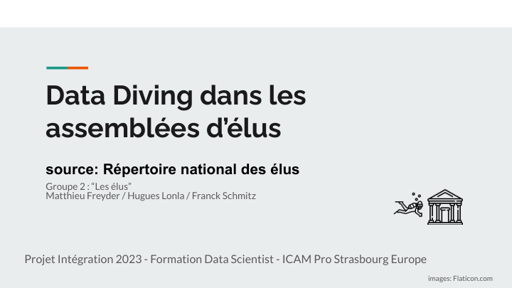
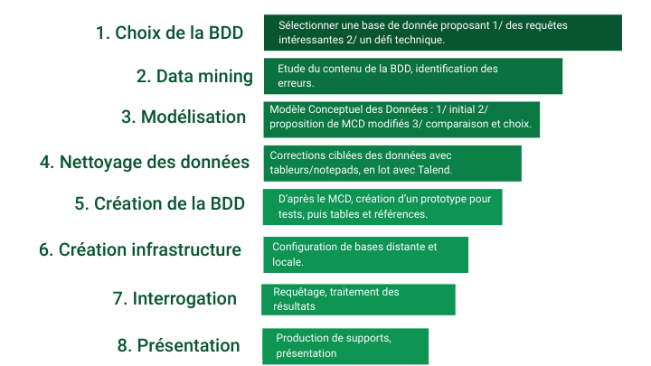

# Projet Intégration de données

Ce projet a été réalisé par notre équipe composée de trois étudiants en Data Science à l'ICAM.

L'objectif de ce projet était de réaliser l'intégration d'une base de données en vue d'être en mesure de répondre à des requêtes de type SQL.

Nous avons choisi de nous pencher sur [le Répertoire National des Élus (RNE)](https://www.data.gouv.fr/fr/datasets/repertoire-national-des-elus-1/), qui recense les élus des différentes chambres (municipales, départementales, régionales, etc.) en France.

[Lien vers la présentation de notre projet (pdf).](presentation/Presentation_Int-Proj-elus.pdf)

Ce projet a été réalisé par notre équipe composée de trois étudiants en Data Science à l'ICAM.

## 🎯 Objectifs et conduite du projet 
Dans le cadre du projet 'Intégration de données', j'ai travaillé en équipe de trois, sur la réalisation d'un ETL (Extract, Transform, Load) pour l'intégration de données provenant de différentes tables de la base de données du [Répertoire National des Élus (RNE)](https://www.data.gouv.fr/fr/datasets/repertoire-national-des-elus-1/).

Les grandes étapes de notre travail ont été les suivantes :

L'objectif de ce projet était de réaliser l'intégration d'une base de données en vue d'être en mesure de **répondre à des requêtes de type SQL**, et de produire des rapports statistiques sur les élus des différentes chambres (municipales, départementales, régionales, etc.) en France, d'étudier la parité au sein des chambres, les nuances politiques des chambres, les mandats cumulés, les élus les plus âgés...

Les difficultés principales résidaient dans la complexité de la base de données, qui était constituée de plusieurs tables non relationnelles (12 tables indépendantes aux informations répétitives), et dans la **nécessité de nettoyer et de transformer les données pour les rendre exploitables**. En effet, les données étaient hétérogènes : les codifications (régions, codes métiers) n'étaient pas uniformes, certaines étant même obsolètes. Les champs de dates n'étaient pas toujours renseignés, et il y avait des erreurs de saisie (dates de naissance, nuances politiques, etc.), ainsi que de nombreux doublons.
Il a fallu mettre en place des procédures de nettoyage et de transformation pour les harmoniser.

Une réflexion de fond a été menée sur la modélisation des données (MCD) pour déterminer la meilleure organisation des tables. Deux approches ont été envisagées :

- Une approche centrée sur les chambres : chaque chambre dispose de sa propre table, optimisée en externalisant les libellés. Pour chaque chambre, les élus y sont répertoriés.
- Une approche centrée sur les élus : chaque élu a sa propre table, indiquant dans quelle chambre il détient un mandat.

L'approche "chambres" a été retenue pour sa simplicité, sa facilité de mise en place, d'exploitation et de mise à jour.

Le nettoyage et la structuration des données ont été réalisés à l'aide de l'ETL Talend, qui a permis de mettre en place des procédures de nettoyage, de transformation et de chargement des données.
Les données ont été stockées dans une base de données Oracle, hébergée sur un serveur Linux (Ubuntu). Un serveur Apache, un serveur MariaDB et un serveur PHP ont été utilisés pour la mise en place d'une interface web permettant de consulter les données . Nous avons utilisé l'outil DBeaver et phpMyAdmin pour la gestion de la base de données, et le requêtage SQL pour l'interrogation des données.
Cette solution nous a permis d'accéder à la base de données de façon distante (ssh), de donner un accès à la base de données à l'ensemble de l'équipe et même au jury le jour de la soutenance. Les requêtes ont ainsi pu être exécutées en temps réel.

Nos requêtes SQL ont permis de répondre à des questions telles que :
- Quelle est la répartition des élus par genre ?
- Quels sont les élus les plus âgés, les plus jeunes ?
- Quelles sont les chambres les plus égalitaires, les plus jeunes, les plus âgées ?
- Quelle est la répartition des élus par nuances politiques ?
- D'identifier les élus cumulant le plus de mandats, les mandats les plus cumulés, etc.

Nous avons ainsi créé un outil s'appuyant sur des données publiques, qui permet de répondre à des questions d'intérêt général sur les élus en France, facilement maintenable et évolutif.

La prochaine étape serait la création d'un Dashboard pour la visualisation des données, et la mise en place d'une API pour l'accès aux données. Notre choix se porterait vers une solution Apache Superset, choix cohérent avec notre stack principalement basé sur des technologies open source.

## 🛠️ Moyens et outils
- Modélisation de données (MCD), logiciel de dessin Dia,
- ETL Talend,
- Serveurs Oracle, OS Linux (Ubuntu), Machine virtuelle, SSH,
- SQL, phpMyAdmin, mariaDB, DBBeaver.

La présentation de ce projet est disponible [ici](presentation/Presentation_Int-Proj-elus.pdf).

